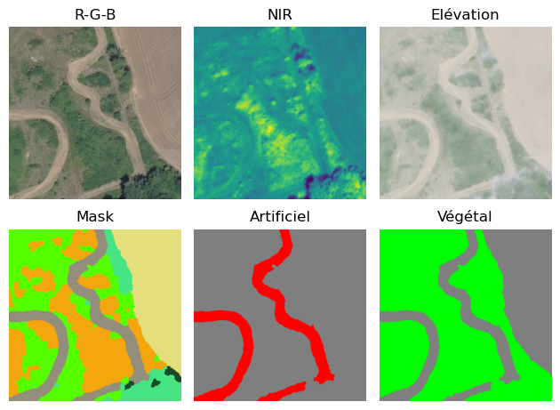
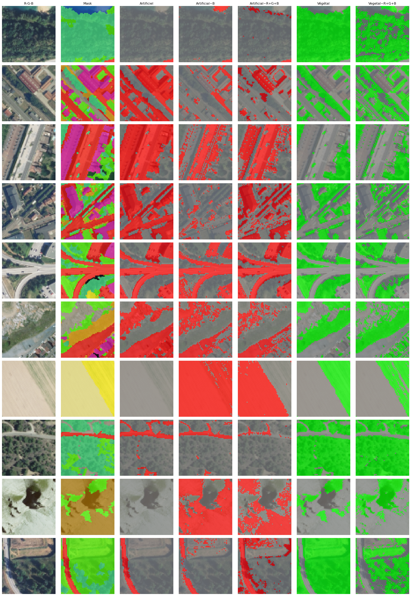

# flairimages

challenge basé sur la dataset Flair#1 (IGNF)

## Origine des données

voir [Flair#1](https://ignf.github.io/FLAIR/index.html) et/ou l'article: [FLAIR: French Land cover from Aerospace Imagery](https://arxiv.org/pdf/2211.12979.pdf)

Crédits à rappeler pour tout usage des données Flair#1:

```text
Anatol Garioud, Stéphane Peillet, Eva Bookjans, Sébastien Giordano, and Boris Wattrelos. 2022. 
FLAIR #1: semantic segmentation and domain adaptation dataset. (2022). 
DOI:https://doi.org/10.13140/RG.2.2.30183.73128/1
```

## Obtenir les données

- télécharger les données voulues sur le [site de l'IGNF](https://ignf.github.io/FLAIR/)
- il faut au minimum le dataset toy et les metadonnées `aerial`
- décompresser les fichiers zip images et labels voulus (e.g. dans le répertoire `[racine du projet]/data/toy` ou `[racine du projet]/data/full`)
- placer de même pour les métadonnées `aerial`
- renseigner l'emplacement des données dans le fichier `[racine du projet]/config/config.yml`


## Objectif

  proposer une tâche d'inférence simplifiée sur les données Flair#1.  
  Par exemple distinguer les sols artificialisés des sols naturels.

## This project

### Configuration
- Toutes les metadonnées doivent autant que possible être stockées dans le fichier `[racine du projet]/config/config.yaml`.

### Working in containers

- vscode :
  - `code .` dans le répertoire racine sur la machine hôte
  - `F1` puis `Dev Containers: Reopen in Container`
  - retour en local (utile pour Git): `F1` puis `Dev Containers: Reopen folder locally`

- Docker + Jupyter lab (superficiellemnt testé):
  - dans le répertoire racine, sous bash:

  ```bash
  docker build -t flairimages ./Docker
  
  docker run -i -t --rm \  
    -p 8888:8888 \  
    -v $(pwd):/workspaces/flairimages \ 
    flairimages
  ```
  
  - relever l'ip avec tocken d'accès dans la sortie texte du container, ctrl+Click sur le lien pour ouvrir Jupyter lab dans le navigateur. E.g.:

  ```text
  [C 2024-09-12 18:32:40.454 ServerApp]  
  
    To access the server, open this file in a browser:  
        file:///root/.local/share/jupyter/runtime/jpserver-1-open.html
    Or copy and paste one of these URLs:  
        http://localhost:8888/lab?token=dfba5c534dc12f4f0440a3afd221b908fb52025d87a96b99  
        http://127.0.0.1:8888/lab?token=dfba5c534dc12f4f0440a3afd221b908fb52025d87a96b99  
  [...]
  ```

## Description des données
- images: fichiers IMG_[id].tif à 5 canaux (RGB + infrarouge + élévation)
- masques: fichiers MSK_[id].tif à 1 canal (label)
- les classes  sont décrites avec leurs regroupements dans le fichier `./config/config.yaml`

### Classes
(voir [src.utils.utils.make_nomenclature_image()](./src/utils/utils.py) pour régénerer ce tableau)


### Exemples de masque
  

  

  

  

  

# Exemples de regression pixel à pixel



