# flairimages

challenge basé sur la dataset Flair#1 (IGNF)

## Origine des données

voir [Flair#1](https://ignf.github.io/FLAIR/index.html) et/ou l'article: [FLAIR: French Land cover from Aerospace Imagery](https://arxiv.org/pdf/2211.12979.pdf)

Crédits à rappeler pour tout usage des données Flair#1:

```text
Anatol Garioud, Stéphane Peillet, Eva Bookjans, Sébastien Giordano, and Boris Wattrelos. 2022. 
FLAIR #1: semantic segmentation and domain adaptation dataset. (2022). 
DOI:https://doi.org/10.13140/RG.2.2.30183.73128/1
```


## Objectif

  proposer une tâche d'inférence simplifiée sur les données Flair#1.  
  Par exemple distinguer les sols artificialisés des sols naturels.

## Obtenir les données, setup

voir ce [fichier](./img/README_SETUP.MD)

## Description des données
- images: fichiers IMG_[id].tif à 5 canaux (RGB + infrarouge + élévation)
- chaque image représente un carré de 10,485.76 m2 au sol soit environ 102 m de coté. Un pixel représente un carré de 20 cm de coté
- masques: fichiers MSK_[id].tif à 1 canal (label)
- les classes  sont décrites avec leurs regroupements dans le fichier `./config/config.yaml`
- les labels 'Artificiel' et 'Végétal' sont propres à ce projet et ne sont pas dans les données originales, ils sont définis dans le fichier `./config/config.yaml`.
Ils sont basés sur les labels originaux de Flair#1 et leur description détaillée dans l'article de référence.

### Classes
(voir [src.utils.utils.make_nomenclature_image()](./src/utils/utils.py) pour régénerer ce tableau)
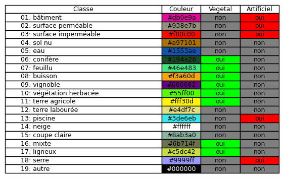


### Exemples de masques de labels

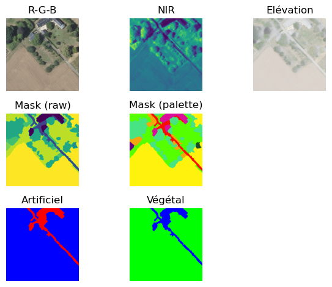  

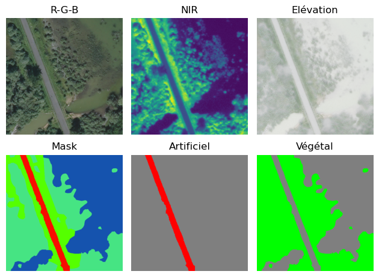  

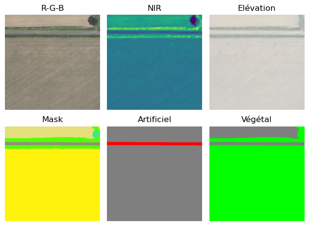  

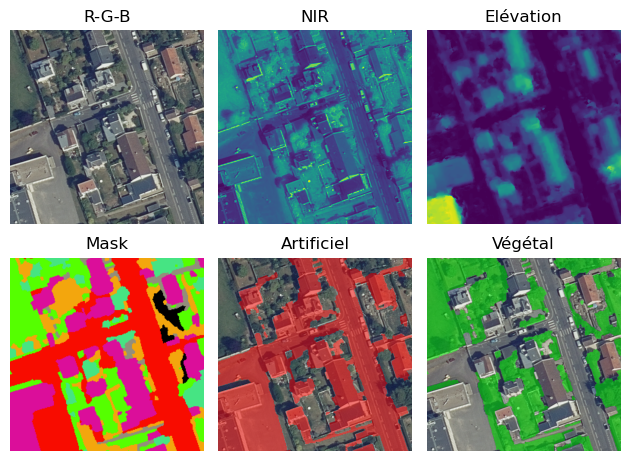  


### Downsampling

- Pour ce projet les images et masques sont downsamplés par un facteur 8x8 (défini dans le [fichier de configuration](./config/config.yml)) pour réduire la taille des données
- Un pixel représente alors une parcelle de 1.6 m de coté
- avant:  
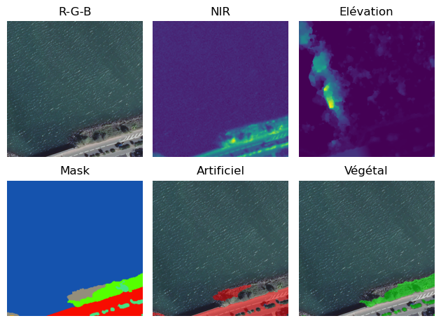
- après:  
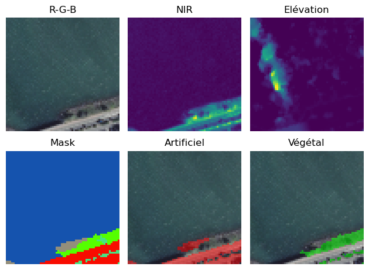

### Distribution intensité de couleurs / classes

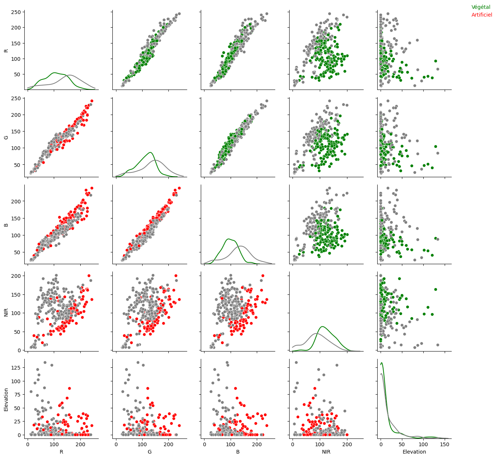

## Régressions pixel à pixel

### Score de différents modèles de régression pixel à pixel
- entrainement et score sur des prises de vue entre 12h et 13h  

| Modèle |  f score |  
| --- | --- |  
| Artificial~R				 | 0.66043 |  
| Artificial~G				 | 0.67052 |  
| Artificial~B				 | 0.7611 |  
| Artificial~NIR				 | 0.65719 |  
| Artificial~Elevation				 | 0.65932 |  
| Artificial~R+G				 | 0.66653 |  
| Artificial~R+B				 | 0.85157 |  
| Artificial~R+NIR				 | 0.74364 |  
| Artificial~R+Elevation				 | 0.67966 |  
| Artificial~G+B				 | 0.88601 |  
| Artificial~G+NIR				 | 0.76791 |  
| Artificial~G+Elevation				 | 0.70419 |  
| Artificial~B+NIR				 | 0.81157 |  
| Artificial~B+Elevation				 | 0.7849 |  
| Artificial~NIR+Elevation				 | 0.67137 |  
| Artificial~R+G+B				 | 0.88316 |  
| Artificial~R+G+NIR				 | 0.76143 |  
| Artificial~R+G+Elevation				 | 0.69139 |  
| Artificial~R+B+NIR				 | 0.84487 |  
| Artificial~R+B+Elevation				 | 0.85527 |  
| Artificial~R+NIR+Elevation				 | 0.7571 |  
| Artificial~G+B+NIR				 | 0.88874 |  
| Artificial~G+B+Elevation				 | 0.88875 |  
| Artificial~G+NIR+Elevation				 | 0.78405 |  
| Artificial~B+NIR+Elevation				 | 0.82468 |  
| Artificial~R+G+B+NIR				 | 0.88021 |  
| Artificial~R+G+B+Elevation				 | 0.88416 |  
| Artificial~R+G+NIR+Elevation				 | 0.77801 |  
| Artificial~R+B+NIR+Elevation				 | 0.8606 |  
| Artificial~G+B+NIR+Elevation				 | 0.89189 |  
| Artificial~R+G+B+NIR+Elevation				 | 0.88246 |  
| Vegetal~R				 | 0.69074 |  
| Vegetal~G				 | 0.66929 |  
| Vegetal~B				 | 0.7422 |  
| Vegetal~NIR				 | 0.67686 |  
| Vegetal~Elevation				 | 0.53048 |  
| Vegetal~R+G				 | 0.68509 |  
| Vegetal~R+B				 | 0.76346 |  
| Vegetal~R+NIR				 | 0.80767 |  
| Vegetal~R+Elevation				 | 0.71093 |  
| Vegetal~G+B				 | 0.79811 |  
| Vegetal~G+NIR				 | 0.80365 |  
| Vegetal~G+Elevation				 | 0.70317 |  
| Vegetal~B+NIR				 | 0.83194 |  
| Vegetal~B+Elevation				 | 0.76727 |  
| Vegetal~NIR+Elevation				 | 0.67495 |  
| Vegetal~R+G+B				 | 0.80142 |  
| Vegetal~R+G+NIR				 | 0.80406 |  
| Vegetal~R+G+Elevation				 | 0.69789 |  
| Vegetal~R+B+NIR				 | 0.83027 |  
| Vegetal~R+B+Elevation				 | 0.78188 |  
| Vegetal~R+NIR+Elevation				 | 0.8193 |  
| Vegetal~G+B+NIR				 | 0.83918 |  
| Vegetal~G+B+Elevation				 | 0.80277 |  
| Vegetal~G+NIR+Elevation				 | 0.82002 |  
| Vegetal~B+NIR+Elevation				 | 0.83841 |  
| Vegetal~R+G+B+NIR				 | 0.84447 |  
| Vegetal~R+G+B+Elevation				 | 0.80846 |  
| Vegetal~R+G+NIR+Elevation				 | 0.8173 |  
| Vegetal~R+B+NIR+Elevation				 | 0.83689 |  
| Vegetal~G+B+NIR+Elevation				 | 0.84286 |  
| Vegetal~R+G+B+NIR+Elevation				 | 0.84681 |  

### Exemples de regression pixel à pixel

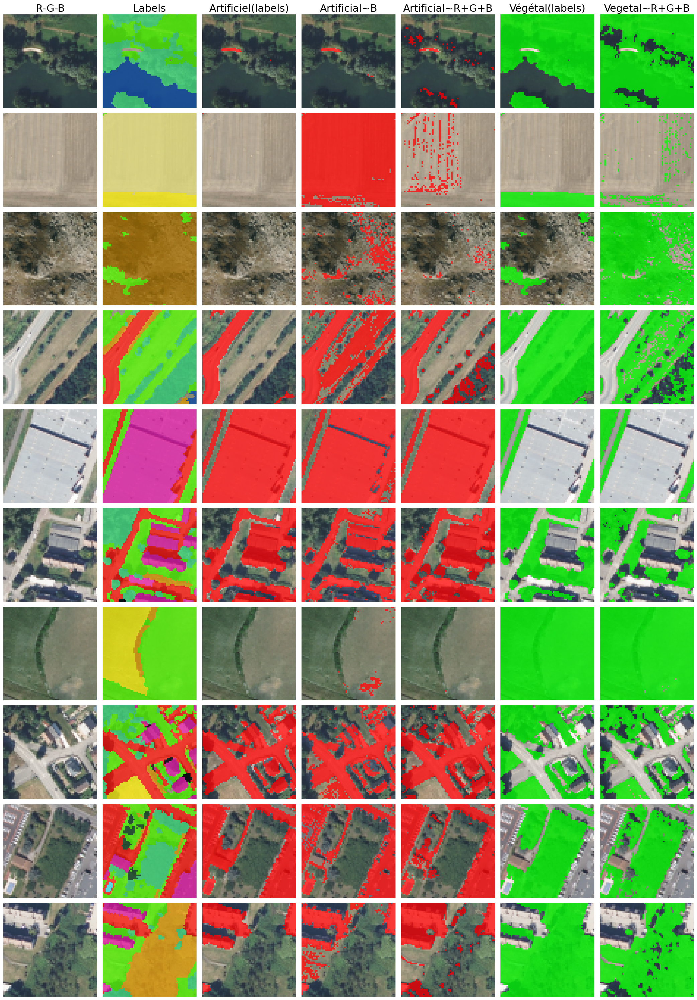  

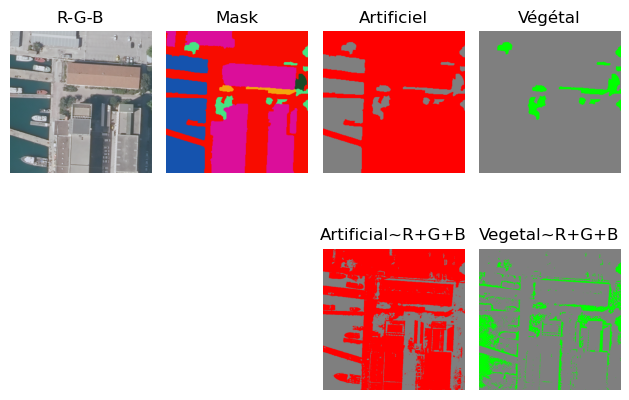  

- La régression a visiblement des difficulté à classer les étendues aquatiques en non-végétal.

## Exercice proposé

- La classe 'Artificiel' est plus facile à prédire que la classe 'Végétal'
- L'exercice proposé serait centré sur la prédiction parcelle par parcelle. Concrètement une parcelle représente un carré au sol de 1.6 m de coté, vu flouté.


- Les images ne sont utilisée que pour la restitution visuelle des résultats et la compréhension du but global de la tâche.
- Amenée dans le bon langage, l'enchainement:  
  - régression à une variable à choisir parmi RGB (la bonne est le canal bleu)
  - régression à deux variables à choisir parmi RGB (R+B ou G+B sont bons)
  - régression R+G+B  

  peut interesser les élèves, avec un feed-back visuel immédiat.

- L'approche parcelle par parcelle permet d'introduire des notions mathématiques de base: seuil de séparation, droite de séparation, etc. sans se préoccuper de géométrie des images.  

- L'artificialisation des sols est un sujet d'actualité.

- Les données sont de qualité proposées par un établissement dédié au service public (<https://www.ign.fr/institut/lign-cartographe-du-service-public>).

### exemples de restitution d'une inférence de 'Artificiel' sur une parcelle
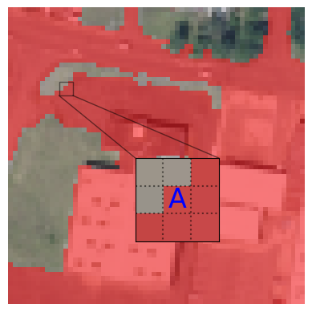

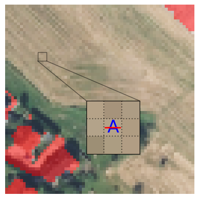
